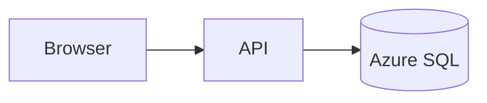

# Documentation instructions

## Every repository has

- `README.md` — what it is, prerequisites, how to run locally, how to test, how to deploy, how to get help.
- `AGENTS.md` (or `.github/copilot-instructions.md`) — the agent-facing contract; start from
  [`templates/AGENTS.md`](../templates/AGENTS.md).
- `docs/adr/` — one Architecture Decision Record per significant decision.
- `CONTRIBUTING.md` and `SECURITY.md` for anything public.

## Style

- Write in clear, direct English, second person, present tense ("Run the tests", not "The tests should be run").
- Lead with the task the reader wants to accomplish.
- Every command must be copy-pasteable and verified to work.
- Use fenced code blocks with a language tag, and tables for option/parameter lists.
- Prefer relative links between repository documents so they resolve on GitHub and in editors.
- Keep lines readable; one sentence per line makes diffs reviewable.

## API documentation

- Generate OpenAPI from code (FastAPI, ASP.NET Core minimal APIs / Swashbuckle) — never hand-maintain it.
- Document for each endpoint: purpose, auth requirement, parameters, request/response schemas, error codes, and an example.
- Version the API in the path (`/api/v1`) and document breaking changes in a changelog.

## Diagrams and presentations

- **Diagrams**: write them as [Mermaid](https://mermaid.js.org/) in a `mermaid` fenced code block so they live in
  the document, diff in review, and render on GitHub. Do not commit binary diagram exports as the source of truth.

````markdown

````

- **Interactive or data-driven visualisation** (dashboards, charts bound to live data): use
  [D3.js](https://d3js.org/) rather than a static image.
- **Presentations**: author slide decks as Markdown with [Marp](https://marp.app/), stored next to the docs they
  support (for example `docs/presentations/`), and export to HTML or PDF from CI or a documented command.

## Architecture Decision Records

```markdown
# ADR-0007: Use Azure Container Apps for the API

- Status: Accepted
- Date: 2026-01-15

## Context
...why a decision was needed, constraints, forces...

## Decision
...what we chose...

## Consequences
...positive, negative, follow-up work...

## Alternatives considered
...options and why they were rejected...
```

## Code comments

- Explain *why*, not *what*. The code already says what it does.
- Document non-obvious invariants, workarounds (link the issue), and performance trade-offs.
- Use docstrings / XML doc comments / JSDoc on public APIs.
- Delete commented-out code; the history keeps it.

## Keeping docs alive

Documentation changes ship in the same pull request as the code change. A pull request that changes behaviour and
leaves the README stale is incomplete.
